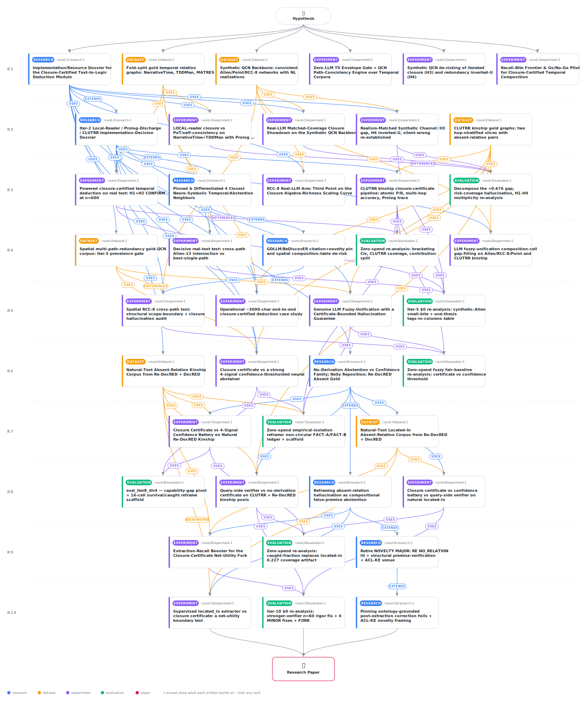

# No Derivation, No Relation: A Closure Certificate for Compositional Absent-Relation Hallucination, and a Structural Net-Utility Boundary on Natural Prose

<div align="center">

<a href="https://cdn.jsdelivr.net/gh/AMGrobelnik/ai-invention-40a89b-no-derivation-no-relation-a-closure-cert@main/workflow.svg">
<picture>
  <source media="(prefers-color-scheme: dark)" srcset="workflow-dark.svg">
  
</picture>
</a>

<sub>🖱️ <b><a href="https://cdn.jsdelivr.net/gh/AMGrobelnik/ai-invention-40a89b-no-derivation-no-relation-a-closure-cert@main/workflow.svg">Open the interactive diagram</a></b> — every card links to its artifact folder.</sub>

</div>

> **TL;DR** — This iteration's paper reframes confident absent-relation hallucination in the deduction sub-module of a text-to-logic pipeline as a compositional false-premise failure and delivers three contributions: (1) a corpus-, domain-, and reader-robust diagnostic (FACT A 30-48% fabrication band; a signal-agnostic capability gap where the certificate's mixed-pool selective accuracy is 0.827 vs 0.37-0.44 for every confidence signal); (2) a gold-free, training-free, no-external-KB no-derivation certificate that catches 0.785 of high-confidence fabrications on a non-by-construction natural sibling-containment regime vs 0.274 for the strongest same-model verifier, 0.100 for a stronger cross-family verifier on its own n=60 subsample, and <=0.40 for every dispersion signal -- reported as targeting quality, not a deployment win; and (3) the decisive new result answering the reviewer's highest-impact request: a precision-preserving extractor built two ways (calibrated GBDT and fine-tuned DeBERTa-v3-small) dominates the prompt-only recall-precision frontier yet still yields no net-utility flip, because located_in transitivity makes present coverage and the certificate's own sibling errors anti-correlated through recall, establishing a structural net-utility boundary deeper than the prompt-only one (gold-read ceiling 1.0/1.0/1.0). The paper fixes the reviewer's rigor major (stronger verifier reported on its own n=60 subsample, corrected caught-fraction table), de-densifies the prose (evidence tags only in the spine table, meta-narration removed, collapsed intro), folds operational and fuzzy notes into a single feasibility appendix, and adds the ontology-grounded post-extraction-correction distinguishing sentence. The certificate mechanism is conceded as the inherited neuro-symbolic premise (+0.673 inherited / +0.0025 novel).

<details>
<summary>Full hypothesis</summary>

ONE THESIS, RE-SCOPED THIS ROUND AROUND THE EXECUTED-AND-FAILED PRECISION-PRESERVING FIX AND THE BINDING TRANSITIVITY INSIGHT (reviewer scope MAJOR now load-bearing + three reviewer MINORs: 'impossibility' overstated, dominance-conflation, and the 0.827 spine over-read). The core is unchanged: in the DEDUCTION SUB-MODULE of a text-to-logic pipeline, keep the LLM a high-recall disjunctive reader, compose ONLY through an exact relation-algebra / finite composition table, and ABSTAIN when iterated closure leaves a disjunction or finds no derivation path. We concede UP FRONT, as the paper's FRAMING not a footnote, that this compose-through-table + abstain-on-collapse machinery is the INHERITED neuro-symbolic premise (+0.673 inherited vs only +0.0025 novel on selective accuracy, art_D0cHQUJ8kY75) — the novelty is NOT the certificate mechanism. The novel CONTRIBUTION is now stated as (i) a corpus-, domain-, and reader-robust DIAGNOSTIC (FACT A + the signal-agnostic capability gap), (ii) a one-sided CATCHING-OBJECTIVE win on a non-structural-by-construction natural regime that beats the confidence family AND the query-side false-premise verifier (same-model AND a stronger cross-family one), and (iii) a now-CHARACTERIZED net-utility BOUNDARY that is EMPIRICAL and STRUCTURAL for the one transitive natural regime in the paper (located_in) and survives the obvious extractor fix.

    RESOLVED THIS ROUND — NOVELTY MINOR FULLY CLOSED (was the last open novelty item). art_y11q_qO5kkPF ($0 web) pins the ontology-grounded POST-EXTRACTION structural-correction foils with web-verified BibTeX — PRIMARY Loconte2026PostExtractionCorrection (arXiv:2605.29168, OAK+MEND, 'targeted LLM-based correction of ontology violations'), NEIGHBOR Chepurova2026Wikontic (arXiv:2512.00590, Wikidata type/domain-range enforcement), NEIGHBOR Feng2024OntologyGrounded (arXiv:2412.20942, HI-AI@KDD 2024) — and writes the single drop-in distinguishing sentence: the no-derivation certificate is a per-query, gold-free abstention from deductive closure over the DOCUMENT-INTERNAL graph, whereas ontology-grounded correction REPAIRS/COMMITS labels against EXTERNAL structure; the gold-free / training-free / no-external-KB delta is preserved. This is a THIRD external-structure foil distinct from Qin2026's external-KB RAG and Sansford2024's NLI-vs-context. art_y11q_qO5kkPF also fixes the framing that iter-10's supervised extractor is standard, INTERCHANGEABLE RE plumbing (the gold-read ceiling 1.0/1.0/1.0 localizes all net-utility headroom to extraction recall, not the certificate), NOT a DEPTH/Li2024/Pi2025-style trained NO_RELATION refiner. The two literature clusters from iter-9 stay engaged: CLUSTER 1 RE NO_RELATION (Yang2025DEPTH 96.9% over-prediction on SciERC NO-RELATION; Li2024RelClassifier attention-dispersion; Pi2025RelPrior binary prior) and CLUSTER 2 training-free structural premise verification (Qin2026PremiseVerification external-KB RAG; Sansford2024GraphEval NLI-vs-context), alongside FalseQA / AbstentionBench / Wen2024. We DROP 'absent-relation hallucination is not derivable a priori'. The two-part delta is SETTING (compositional, multi-hop, document-internal absent-relation premise vs single-hop schema-bound NO_RELATION and sentence-level false premise) + METHOD (gold-free, training-free, no-external-KB deductive-closure certificate vs trained RE refiners/classifiers, external-KB/RAG premise checks, NLI-vs-context triple checks, and ontology-grounded post-extraction correction). VENUE = ACL Knowledge Extraction PRIMARY, NeSy / EMNLP FALLBACK (matches the user's stated target).

    CORRECTION A — THE PRECISION-PRESERVING EXTRACTOR FIX (PATH 3) WAS EXECUTED AND DID NOT FLIP THE BOUNDARY; THE NATURAL-PROSE NET-UTILITY LIMIT ON TRANSITIVE located_in IS AN EMPIRICAL STRUCTURAL BOUNDARY, DEEPER THAN THE PROMPT-ONLY ONE (reviewer scope MAJOR + rigor MINOR). iter-10's art_fg_Yo5LRCY2d built a TRAINED, threshold-tunable, precision-preserving located_in extractor two independent ways — (A) a calibrated LightGBM GBDT over ~30 engineered per-pair features and (B) a fine-tuned microsoft/deberta-v3-small encoder over marked windows — over ORDERED gold-entity pairs co-occurring within W=2 sentences (NO name-grounding step, isolating relation-extraction recall), isotonic-calibrated on a doc-disjoint fold so tau maps to precision, trained doc-disjoint (2321 train docs vs 283 eval docs; leakage guard asserts disjointness). Its edges feed the FROZEN certificate engine at 10 precision-preserving operating points; ALL 6 confident-wrong competitors (4 dispersion signals + 2 query-side verifiers) are replayed byte-identical at $0 (18722 cache hits, snapshot vs iter-8 FROZEN8 = 1215/1215, 0 mismatch). VERDICT = NET-UTILITY-BOUNDARY-STRUCTURAL: across BOTH families and all 10 thresholds, NO operating point lifts the worst-case (min-over-6-competitor) mixed-pool confident-wrong reduction CI above 0 (0 sweet spots; best worst-case reduction -0.001, CI-lower -0.0033). The MECHANISM is an anti-correlation read directly off the sweep: the query-side verifier's sibling confident-wrong is FIXED at 0.218 (it ignores the extracted graph); the certificate's is FAR LOWER at high-precision points (0.011 at recall 0.281) where it abstains structurally, BUT present coverage there is only 0.025 so throttled competitors commit ~nothing and there is nothing to beat; raising recall to lift present coverage pushes the certificate's OWN sibling confident-wrong UP in near-lockstep (0.327 at recall 0.650, crossing the verifier's fixed 0.218 near recall 0.636) because located_in TRANSITIVITY turns each recall-bought sibling false-edge into a spurious containment PATH. The two win-requirements (present coverage high enough to beat throttled competitors AND sibling-CW below the fixed verifier) are ANTI-CORRELATED through extraction recall, so no operating point satisfies both. The gold-read ceiling stays 1.0/1.0/1.0 throughout: the headroom exists but is not extractor-reachable on this regime. RIGOR FIX (reviewer MINOR): call this an EMPIRICAL STRUCTURAL BOUNDARY (10 operating points x 2 families, 0 sweet spots, with a mechanistic anti-correlation explanation), NOT a 'structural impossibility result' / 'theorem' — the artifact itself uses 'NET-UTILITY-BOUNDARY-STRUCTURAL' / 'intrinsic'. Optionally STRENGTHEN with a short analytic argument bounding the spurious-derivation-path injection rate as a function of extractor recall and transitive-closure depth; otherwise keep it explicitly empirical. Drop every 'impossibility' / 'theorem' phrasing in intro and discussion.

    CORRECTION A2 — STATE THE FRONTIER-DOMINANCE RELATIONSHIP CORRECTLY (reviewer clarity MINOR; do not let 'both dominate the frontier' conflate two different relationships). The supervised extractor escapes the prompt-only precision tax, but in TWO distinct ways the artifact distinguishes: (a) the GBDT genuinely DOMINATES prompt-only WITHIN the overlapping recall interval [~0.15, 0.23] (8/8 comparable prompt-only points won on precision and CI-lower); (b) the encoder's LOWEST operating recall (0.281 at precision 0.929) EXCEEDS the prompt-only ceiling (0.227), so it has NO matched-recall points against prompt-only and instead EXTENDS precision-preserving extraction into a recall regime prompt-only never reached (up to recall 0.650 at precision 0.586). Do NOT say the encoder 'dominates at every matched recall.' Also state explicitly that in the overlapping range the supervised net-utility CI-lower-vs-recall SLOPE is comparable to prompt-only (-0.325 vs -0.304), so the win is in absolute precision/LEVEL, not in degradation RATE. This removes an easy target without weakening the real result.

    CORRECTION B (THE BINDING MAJOR) — THE CATCHING WIN AND THE NET-UTILITY FAILURE ARE TWO FACES OF located_in TRANSITIVITY; THE DECISIVE iter-11 TEST IS A NON-TRANSITIVE NATURAL DEDUCTIVE ABSENT REGIME, OR A STATED CONSTRUCTIBILITY LIMIT + REFRAME. The reviewer's load-bearing observation: the ONLY non-by-construction natural absent regime in the paper (located_in same-component siblings) is PRECISELY the transitive regime where the net-utility boundary is structural. The 0.785 targeting-quality catching win (siblings SHARE A PARENT, which both fools the relatedness verifier AND is what makes the certificate's structural abstention non-trivial) and the net-utility failure (recall-bought false edges re-create spurious containment paths) are the SAME located_in transitivity scored two ways. So the single natural regime where a non-trivial CATCHING win is demonstrable is exactly the one where NET UTILITY provably cannot be achieved, and building the precision-preserving extractor (the prior round's requested fix) DEEPENED the boundary rather than lifting it. With the closure/abstain mechanism conceded inherited (+0.673 vs +0.0025), the net positive deployable contribution on natural prose is currently: a DIAGNOSTIC + a one-sided CATCHING demonstration + a NEGATIVE BOUNDARY. THE DECISIVE iter-11 EXPERIMENT (PATH 5, the highest-impact move available): demonstrate a NET-UTILITY win — matched-coverage mixed-pool confident-wrong reduction with Holm-adjusted doc-clustered bootstrap CI EXCLUDING 0, certificate matching/beating the query-side verifier — on a natural, non-by-construction, NON-TRANSITIVE absent regime, the paper's own named next step, where the transitive false-edge amplification should NOT arise. CANDIDATE: a KINSHIP- or MEMBERSHIP-style relation with a SAME-COMPONENT co-parent / sibling-figure / non-composable-path absent regime that is GENUINELY DEDUCTIVE (two entities in one connected component whose composition over the finite kinship/membership table yields EMPTY because the relevant cell is UNDEFINED — e.g. 'spouse's sibling's spouse', 'co-member-via-a-third-org' — NOT different-component, which is structural-by-construction and carries no evidential weight). PREDICTION/RATIONALE: because the kinship table has no single dominant transitive relation, a recall-bought false atomic edge does NOT propagate into a spurious multi-hop derivation the way located_in transitivity does, so the certificate's own confident-wrong should stay decoupled from present coverage and a net-utility flip MAY be reachable. FORK (both publishable, pre-registered): (B-i) IF such a regime is constructible AND the certificate's Holm-adjusted mixed-pool confident-wrong reduction EXCLUDES 0 on natural prose (matching/beating the verifier) -> the headline converts from 'diagnostic + targeting-quality win + structural boundary' to 'diagnostic + DEMONSTRATED NET FIX on non-transitive relations', lifting the contribution/overall score; (B-ii) IF NO such genuinely-deductive non-transitive same-component absent regime is constructible from existing Re-DocRED-style corpora (a real risk — Re-DocRED kinship absent pairs were different-component, structural-by-construction, because same-component non-composable kinship pairs are rare/under-annotated), then STATE THAT CONSTRUCTIBILITY LIMIT EXPLICITLY AS A CONTRIBUTION and reframe the headline as 'diagnostic + PROVABLE BOUNDARY for transitive relations + a corpus-constructibility limit on the deductive non-transitive absent regime' — instead of leaving the impression that a deployable fix is one experiment away. Either branch is a finished, honest result; the gold-read ceiling (1.0/1.0/1.0) guarantees the headroom is all in extraction, so this regime choice is the only remaining high-leverage lever. CHEAPER ALTERNATIVE (PATH 4, retained): a naturally-HIGH-RECALL semi-structured input (infoboxes / list-structured / explicit relational prose) where extraction recall is high a priori, run as the SAME mixed-pool showdown — but only a NON-transitive relation there avoids the located_in trap, so PATH 4 and PATH 5 should be combined (high-recall input AND non-transitive relation).

    CORRECTION C — THE 0.785 CAUGHT-OBJECTIVE WIN IS TARGETING QUALITY, NOT DEPLOYABLE NET-UTILITY; PAIR IT WITH THE EXTRACTION-GATED CAVEAT EVERYWHERE (reviewer evidence, carried). The matched-coverage-FAIR caught fraction is the correct headline metric on the non-by-construction same-component-sibling regime (art_4xy3D05YxvRr re-analysis: certificate 0.785 vs verbalized 0.400 / P(True) 0.304 / self-verify 0.459 / query-side verifier 0.274 / sc_margin 0.067 / semantic-entropy 0.067; all SIX certificate-minus-competitor caught-gaps exclude 0, doc-clustered paired bootstrap B=10000, seed 20260617; natural confident-wrong certificate 0.073 vs raw/all-dispersion 0.30 vs verifier 0.218, ~3x). It REPLACES the earlier '0.2267 reduction at matched coverage' sentence, which the re-analysis exposed as MECHANICAL (0.30 - 0.0733) — a pure-absent identity (named-rate == confident-wrong == coverage on the 450-pair absent pool), NOT a risk-coverage gain. The caught objective is ONE-SIDED: on a pure-absent pool it measures only how well a method's abstentions TARGET the fabrications, and it structurally REWARDS methods that abstain more on absent pairs. The deployment-relevant DUAL — net utility on a MIXED present/absent pool — is exactly where the same structural abstention OVER-abstains on present pairs and LOSES on natural prose (extraction-gated, and on located_in additionally bounded by the structural transitivity result of CORRECTION A/B). Whenever the 0.785 number appears (abstract, intro, contribution list, conclusion), it MUST be paired in the SAME sentence with the net-utility caveat (extraction-gated, NOT a deployment win) and a note that the catching objective inherently favors high-abstention methods on the absent subset, so the win establishes TARGETING QUALITY only.

    CORRECTION C2 — PAIR THE 0.827 CAPABILITY-GAP SPINE WITH ITS OWN CLUTRR-ONLY / BY-CONSTRUCTION QUALIFIER (reviewer evidence MINOR, NEW). The signal-agnostic capability gap (certificate selective accuracy 0.827 vs signals 0.37-0.44; Holm-adjusted confident-wrong reductions 0.103-0.121, CIs exclude 0) is a DEPLOYABLE net-utility advantage ONLY on by-construction TEMPLATED CLUTRR; on BOTH natural domains the certificate TIES or LOSES the mixed-pool comparison (Re-DocRED kinship 0.475 vs 0.60-0.675, CIs include 0; located_in present coverage collapses to 0.05). In the abstract AND contribution 1, attach the 'CLUTRR-only / by-construction disconnected-component absence' qualifier in the SAME sentence as the 0.827 number — mirroring the targeting-quality caveat now paired with 0.785 — so a reader does not carry 0.827 forward as a natural-prose net-utility result. The capability gap is the reader-invariant SPINE of the DIAGNOSTIC (no scalar knob separates confident-and-right present from confident-and-wrong absent), powered only on clean CLUTRR; CLAIMs 2-3 test it on natural prose.

    CORRECTION D — DE-DENSIFY AND DELETE REVIEWER-RESPONSE META-NARRATION (reviewer clarity MINOR). Rewrite all iteration-loop reply phrasings ('The reviewer's fix, executed', 'A reviewer asked, correctly, for the highest-impact fix... We did exactly that, two independent ways', 'sharpened this iteration into', 'We concede one thing up front') as DECLARATIVE method statements (e.g. 'To test whether better extraction flips the boundary, we build a precision-preserving extractor two ways; it does not, for a structural reason'). Remove every 'this iteration' / 'a reviewer asked'. Move secondary statistics out of prose into the existing tables so the narrative carries only load-bearing figures. Keep evidence-class tags (REAL-LLM-READ, GOLD-ONLY-GATE, etc.) in the SPINE TABLE and section headers ONLY; delete inline markers in results prose. FOLD the operational ~3000-char note and the fuzzy-unification note into a SINGLE feasibility appendix; keep the explicit out-of-scope statement (OpenCyc grounding, atomic re-extraction, general fuzzy unification, genuine ~3000-char documents) in the intro.

    ----- CLAIM 1 (THE SPINE, EMPIRICAL DIAGNOSTIC). TAG: REAL-LLM-READ. -----
    FACT A (ROBUST, load-bearing non-circular fact): the raw LLM emits a confident absent-relation fabrication at HIGH confidence — CLUTRR 47.2% (gemini) / 48.3% (deepseek), Re-DocRED kinship 32.6% / 31.8%, Re-DocRED located_in SIBLING 30.0% (gemini, mean conf 0.94, 94.8% at conf>=0.9) / 43.8% (mistral) — corpus-, domain-, AND reader-transferable, the compositional/document-internal lift of the single-hop RE over-prediction DEPTH documents (96.9% on SciERC NO-RELATION). THE MIXED-POOL CAPABILITY GAP (signal-agnostic, the spine, but CLUTRR-only deployable per CORRECTION C2): no single confidence threshold can both cover present and abstain on absent at matched coverage (powered on CLUTRR: certificate selective accuracy 0.827 vs every signal 0.37-0.44; Holm-adjusted confident-wrong reductions 0.103-0.121, CIs exclude 0). FACT B is reported HONESTLY per-signal x reader x corpus via the 16-cell SURVIVAL/CAUGHT table (caught swings ~15% Re-DocRED/gemini to ~90% CLUTRR/deepseek; verbalized confidence the most ROBUSTLY blind; dispersion signals catch the MAJORITY for the stronger deepseek reader), NOT as family-level / reader-diverse blindness; the 'no signal removes a single one' phrasing is scoped to the LLM's NATURAL (no-abstention) coverage only — at the certificate's coverage P(True) already catches 75.3% on CLUTRR / 51.7% on natural Re-DocRED. The multi-hop PRESENT selective-accuracy win (CLUTRR 0.886 vs 0.543 at matched coverage 0.686) is the INHERITED NeSy premise, labeled. CLUTRR-absent 2.8% confident-wrong is STRUCTURAL-BY-CONSTRUCTION (disconnected components) and never carries the section.

    ----- CLAIM 2 (THE NON-BY-CONSTRUCTION CATCHING WIN, ESTABLISHED but ONE-SIDED + TRANSITIVE-REGIME-CONFINED). TAG: REAL-LLM-READ. -----
    On the Re-DocRED located_in SAME-COMPONENT-SIBLING regime (art_RfjDpsGkBXDG, 20,814 such pairs; two places in one component sharing a parent but neither containing the other, so closure derives EMPTY because located_in o contains is UNDEFINED — a GENUINE deductive abstention, NOT 'disconnected => trivially empty'), the certificate CATCHES 0.785 of the raw LLM's high-confidence fabrications vs <=0.40 for every dispersion signal, 0.274 for the same-model query-side verifier, and (on its own n=60 subsample) 0.10 for the stronger cross-family verifier; all six certificate-minus-competitor caught-gaps exclude 0. Decisive for the CATCHING objective because (i) the raw reader fabricates a containment on 30% of sibling pairs vs only 6% of different-component pairs, and (ii) a relatedness verifier is ACTIVELY FOOLED by the shared parent (returns RELATED at conf 1.0). HONESTY (CORRECTION C): TARGETING-QUALITY, NOT a deployment net-utility win, one-sided on a pure-absent pool — AND, per CORRECTION B, this win and the located_in net-utility FAILURE are the SAME transitivity scored two ways, so this regime cannot itself host a deployable net win. The query-side verifier baseline (same-model AND stronger cross-family on its own subsample) is the established detect-then-respond method, so the certificate's edge over it is load-bearing (art_963U_7mCLAMJ: certificate catches 0.941/0.850 vs verifier 0.588/0.100 on CLUTRR / Re-DocRED kinship; CIs exclude 0).

    ----- CLAIM 2b (STRONGER-VERIFIER ROBUSTNESS, ESTABLISHED; report on its OWN n=60 denominator). TAG: REAL-LLM-READ. -----
    A stronger, larger, different-family query-side verifier (deepseek-v3.2, k=5 self-consistency) catches only 0.10 of the raw LLM's confident sibling containment fabrications — WORSE than the same-model weak verifier (0.20 on this subsample) and far below the certificate (0.667) — because a better geographer OVER-infers co-regional containment (art_fXvxt4JO9hWy stronger_verifier_block). REPORT these in their OWN small table / clearly-labeled footnote on the n=60 subsample (deepseek-v3.2, k=5; n_sibling=250, 60 raw fabrications: certificate 0.667 > self-verify-strong 0.533 > weak same-model 0.20 > stronger cross-family 0.10) and NEVER place 0.10 in the same column/denominator as the main pool's certificate 0.785 / same-model verifier 0.274 (n=450/135) — that juxtaposition is apples-to-oranges (verified two-copy-consistent + strict within-subsample ordering asserted in art_lwoQWfQWMQfc; the corrected tab:locatedin removes 0.100 and demotes it to a footnote with an automated guard). Certificate-necessity is intrinsic to running the premise check on a generative LLM, NOT an artifact of a weak same-model verifier (retires methodology MINOR #5).

    ----- CLAIM 3 (THE DECISIVE OPEN EXPERIMENT for iter-11, REDEFINED to a NON-TRANSITIVE DEDUCTIVE ABSENT REGIME). TAG: REAL-LLM-READ. -----
    PATH 2 (prompt-only extraction-recall fix) is RETIRED EXECUTED->FAILED (art_fXvxt4JO9hWy; recall is precision-bought, slope -0.30 / -0.67). PATH 3 (precision-preserving / fine-tuned extractor on transitive located_in) is RETIRED EXECUTED->FAILED FOR A STRUCTURAL REASON (art_fg_Yo5LRCY2d; 0/10 operating points flip, both families; transitive false-edge amplification). The new decisive test is PATH 5 (CORRECTION B): a NET certificate win on a natural, non-by-construction, NON-TRANSITIVE, GENUINELY-DEDUCTIVE same-component absent regime (kinship/membership co-parent / non-composable-path), at matched coverage vs the four-signal battery AND the query-side verifier, with Holm-adjusted doc-clustered CIs; optionally combined with PATH 4 (naturally-high-recall semi-structured input) so extraction recall is high a priori. FORK (both publishable): IF the certificate's Holm-adjusted mixed-pool confident-wrong reduction EXCLUDES 0 there AND it matches/beats the verifier -> 'diagnostic + DEMONSTRATED NET FIX on non-transitive relations'; IF no such regime is CONSTRUCTIBLE from Re-DocRED-style corpora -> the constructibility limit IS a contribution and the headline becomes 'diagnostic + provable boundary for transitive relations + constructibility limit on the deductive non-transitive absent regime'. The gold-read ceiling (1.0/1.0/1.0) guarantees the entire headroom is in extraction, so the regime choice is the only high-leverage lever left.

    ----- CLAIM 4 (GENUINE FUZZY UNIFICATION, FEASIBILITY NOTE, FOLDED). TAG: REAL-LLM-READ. -----
    art_I22c-J7-OcXl retired the iter-4 circular Mode-P: vague prepositions / informal kinship terms yield CALIBRATED sub-1.0 disjunctions (fraction-at-1.0 = 0.00 vs Mode-P's 1.00; per-candidate ECE 0.142 spatial / 0.111 kinship); the distinctive Mode-B catch (around -> {NTPPi,TPPi} drops gold EC => collapse => abstain; 5/5 sound-violating spatial reads caught, 0 silent-wrong missed; kinship UNTESTED, 0 unsound reads). FOLD into a single short FEASIBILITY appendix together with the operational ~3000-char case study (CLAIM 6). Keep the supporting query-level cert CW 0.000 vs commit-argmax 0.364/0.216 (CIs exclude 0, art_0MDLD-w-RXOu) with the query-vs-edge unit-of-analysis caveat. Feasibility on commodity hardware, NOT a substantive contribution.

    ----- CLAIM 5 (SUPPORTING NEGATIVE): CROSS-PATH CODING IS SYNTHETIC-CHANNEL-ONLY. TAG: GOLD-ONLY-GATE + SYNTHETIC-CONTROL. -----
    The cross-path-intersection coding mechanism is established at power ONLY on synthetic channels and FAILED on BOTH a-priori-gated real venues for opposite reasons (temporal Allen reads near-universe 0.87, intersection/best-single/naive all resolve 0/125, deepseek MORE conservative 0.99, art_0AIWMhwc1pJM; spatial RCC-8 reads informatively but gold is a containment TREE with one edge-disjoint path per query, art_i53dBKgGY3Ig). Synthetic positive controls confirm the mechanism when both conditions hold (Allen +0.259 selective accuracy CI [0.177,0.349]; RCC-8 0.890 vs 0.797). Present as an explanatory account of two gated-venue negatives, NOT a law; do NOT re-run RCC-8.

    ----- CLAIM 6 (NATURAL TEMPORAL TEXT: certificate only WEAKLY protective; OPERATIONAL CASE STUDY FOLDED). TAG: REAL-LLM-READ. -----
    On natural temporal text the raw LLM out-accuracies Mode-A at matched coverage (0.699 vs 0.575); the corrected fixed-operating-point H1 CIs INCLUDE 0 (vs PoT +0.027 [-0.088,0.140]; vs SC +0.035 [-0.061,0.135]; the earlier CONFIRM was a bootstrap artifact, art_Vc1UBGIVSi0T). Among ~19% Mode-A commits, 42.5% confident-wrong, all silent-wrong-narrowing. A $0 synthetic backstop (recall 0.96) gives Mode-A +0.225 over raw, isolating read-soundness as the binding constraint. FOLD the operational ~3000-char bracket-selected arm (95 Prolog programs discharged & executed in swipl 9.0.4; hallucination reduction 0.27-0.60 / mean 0.45 at Mode-A coverage 0-0.33; atomic recall ~0.49 the binding ceiling, art_WQoePKrpsTPo) into the single FEASIBILITY appendix; CUT the concatenated-kinship arm (56/56 cross-story abstentions trivial by construction). Label documents bracket-selected; the pipeline RUNS at length, not that it is USEFUL at length. Supporting, not headline.

    ----- CLAIM 7 (MECHANISM ANALYSIS / APPENDIX, DEMOTED). TAG: REAL-LLM-READ-ON-SYNTHETIC + SYNTHETIC-CHANNEL + THEOREM. -----
    Compact appendix, labeled inherited/synthetic/textbook: (7a) ALGEBRA-RICHNESS SCALING (point +0.043 -> RCC-8 +0.448 -> Allen +0.676; INHERITED table-vs-LLM-composition at recall ~1.0; +0.676 decomposes +0.673 inherited / +0.0025 novel); (7b) REDUNDANCY INVERTED-U on a realism-matched channel (Page p ~ 5e-4, peak K* = 2,4,7,10,16 for recall 0.5->0.95, silent-wrong 0.006->0.146 bounded by (1-r)); (7c) the ZERO-FP soundness THEOREM (all-sound contributing edges => gold in Mode-A output w.p. 1.0; verified on 100,296 networks; recall and rho are INPUTS, so it characterizes rather than predicts a real-text operating point). None competes with the diagnostic headline.

    ----- CLARITY FIX: RE-DOCRED + LOCATED-IN COUNTS PER-DATASET. -----
    Kinship: re-docred PRIMARY slice = 360 present multi-hop (222 composed-only / non-circular) + 368 absent; the 476/476 present and 577/577 absent engine round-trip is COMBINED re-docred (360/368) + docred (116/209) (docred absent gold DOWNGRADED ~64.6% false-negatives). Located_in: 515 present (400 held-out + 115 never-annotated) / 450 sibling-absent / 250 different-component-absent over 283 docs / 1,215 queries (count_reconciliation in art_4xy3D05YxvRr; supervised-extractor pool reproduces these counts vs FROZEN8).

    ----- METHOD CORE (unchanged in substance; re-scoped). -----
    MODE A (SOUND NARROWING / no-derivation abstention, PRIMARY, READ-SOUNDNESS-CONDITIONAL zero-FP): high-recall sub-universal disjunction per span; compose+intersect through the EXACT table -> EMIT singleton / ABSTAIN disjunction / ABSTAIN 'no relation' on no-derivation. The cross-path-INTERSECTION variant is SYNTHETIC-ONLY-at-power (CLAIM 5); CLUTRR, kinship, located_in use a union-fixpoint, not intersection. MODE B (DETECTION/REPAIR, SECONDARY): empty closure certifies an UNSOUND read (gold-free, recall-conditional). BASELINES: every certificate comparison includes (i) the CONFIDENCE-THRESHOLDED RAW-ABSTAIN battery (verbalized + sc_margin + P(True) + semantic-entropy negentropy) at MATCHED coverage, AND (ii) a QUERY-SIDE FALSE-PREMISE VERIFIER — same-model relatedness + self-verification AND a stronger cross-family (deepseek-v3.2 k=5) instantiation, the latter on its OWN subsample — alongside always-answer commit-the-argmax, PoT, and self-consistency. EXTRACTION (the now-binding lever): prompt extraction recall is the natural-prose ceiling (located_in 0.148, kinship 0.376); prompt-only boosting raises recall ONLY by buying precision (art_fXvxt4JO9hWy); a PRECISION-PRESERVING (fine-tuned GBDT / deberta-v3-small / constrained-decoding) extractor DOMINATES the prompt-only frontier (recall 0.65 @ precision 0.59) but on TRANSITIVE located_in does NOT flip net utility (art_fg_Yo5LRCY2d). GENERALITY, TEMPERED: EXACT only on the convex point algebra (PC complete); Allen IA and RCC-8 are SOUND LOWER BOUNDS; kinship and located_in are finite composition tables, NOT relation algebras, NOT cross-path-intersection venues; located_in is TRANSITIVE (single dominant transitive cell -> false-edge amplification), kinship is NOT (no single dominant transitive cell -> the predicted escape from the located_in trap).

    ----- HONESTY COMMITMENTS. -----
    (1) Evidence-class tags live in the SPINE TABLE and section headers, NOT inline in prose. (2) Do NOT call CLUTRR natural — it is TEMPLATED (<=871 chars, hand-supplied table). (3) The certificate MECHANISM is the INHERITED NeSy premise (+0.673 inherited / +0.0025 novel); candidate NOVELTY is the DIAGNOSTIC (FACT A + capability gap) + the CATCHING win + the characterized boundary; the certificate-as-FIX is PENDING a precision-preserving NON-TRANSITIVE natural net win or a stated constructibility limit. (4) Position the diagnostic as a COMPOSITIONAL false-premise instance; cite RE NO_RELATION (DEPTH/Li2024/Pi2025), premise-verification (Qin2026/Sansford2024), ontology-grounded post-extraction correction (Loconte2026/Chepurova2026/Feng2024), and FalseQA/AbstentionBench/Wen2024; DROP 'not derivable a priori'; KEEP the ontology-grounded distinguishing sentence; VENUE = ACL Knowledge Extraction PRIMARY, NeSy/EMNLP FALLBACK. (5) FACT A transfers (corpus/domain/reader); FACT B is reader- and signal-dependent (16-cell survival/caught table); do NOT claim family-level / reader-diverse blindness. (6) The CLUTRR-absent abstention AND the located_in different-component abstention are STRUCTURAL-BY-CONSTRUCTION; the sibling caught-objective win is non-by-construction but ONE-SIDED (targeting quality) and must be paired with the extraction-gated caveat; the 0.827 capability gap is CLUTRR-only and must carry its by-construction qualifier in the same sentence. (7) The natural-prose net-utility boundary is EXTRACTION-LIMITED; on transitive located_in it is an EMPIRICAL STRUCTURAL boundary (not an 'impossibility'/theorem) that a precision-preserving extractor does NOT lift (0/10 points; anti-correlation of present coverage and certificate sibling-CW through recall; gold-read ceiling 1.0/1.0/1.0). (8) Report the stronger cross-family verifier on its OWN n=60 subsample (cert 0.667 / weak 0.20 / stronger 0.10 / self-verify-strong 0.533), never beside the n=450/135 numbers. (9) State frontier-dominance correctly: GBDT dominates WITHIN the overlap [~0.15,0.23]; the encoder EXTENDS beyond the prompt-only recall ceiling; the win is precision/LEVEL not degradation RATE (matched-range slope -0.325 vs -0.304). (10) Cross-path coding is SYNTHETIC-CHANNEL-ONLY. (11) zero-FP is READ-SOUNDNESS-CONDITIONAL. (12) Report every hallucination number WITH coverage/abstention. (13) SWI-Prolog execution reported truthfully. (14) DEDUCTION SUB-MODULE only — OpenCyc grounding, atomic re-extraction, general fuzzy unification, genuine ~3000-char documents are FUTURE WORK NOT CLAIMED; fold operational + fuzzy notes into one feasibility appendix. (15) Remove all reviewer-response meta-narration; declarative claims-with-caveats only.

    SUCCESS / DISCONFIRM (re-centered on the diagnostic + the NON-TRANSITIVE net-utility test). CONFIRM if: (i) FACT A and the MIXED-POOL CAPABILITY GAP reproduce, reported honestly per-signal/reader/corpus, engaging the RE-NO_RELATION + premise-verification + ontology-correction + false-premise literature with a query-side verifier baseline (same-model AND stronger cross-family on its own subsample) — the corpus-robust DIAGNOSTIC; AND (ii) the certificate's Holm-adjusted MIXED-POOL confident-wrong reduction EXCLUDES 0 on a natural NON-TRANSITIVE genuinely-deductive same-component absent regime (PATH 5, optionally with PATH 4 high-recall input) AND it matches/beats the query-side verifier — the DEMONSTRATED FIX; AND a SWI-Prolog-executed pipeline reports atomic P/R, multi-hop accuracy, trace-graphs, and abstention beside every hallucination number. DISCONFIRM / SCOPE-BOUNDARY (each publishable): some confidence signal robustly filters confident absent hallucinations at matched coverage for the deployed reader (=> FACT B reader-defeated, diagnostic narrows); OR even a precision-preserving extractor cannot lift the mixed-pool reduction CI above 0 on a TRANSITIVE relation because the recall<->certificate-sibling-CW anti-correlation is structural (OBSERVED on located_in, art_fg_Yo5LRCY2d => EMPIRICAL STRUCTURAL boundary for transitive relations); OR no genuinely-deductive NON-TRANSITIVE same-component absent regime is CONSTRUCTIBLE from existing corpora (=> the constructibility limit is the contribution, headline reframes to 'diagnostic + provable boundary for transitive relations'); OR the query-side false-premise verifier (same-model or stronger) already catches the fabrications as well as the certificate (NOT observed: stronger verifier WORSE, 0.10 vs cert 0.667 on its subsample); OR cross-path intersection never beats single-path on any real multi-path stratum (already observed => coding mechanism honestly synthetic-only).

</details>

[](https://cdn.jsdelivr.net/gh/AMGrobelnik/ai-invention-40a89b-no-derivation-no-relation-a-closure-cert@main/paper.pdf) [](https://github.com/AMGrobelnik/ai-invention-40a89b-no-derivation-no-relation-a-closure-cert/tree/main/paper_latex)

This repository contains all **41 artifacts** produced across **10 rounds** of an autonomous AI research run — round by round, exactly in the order they were invented.

## Round 1

| Artifact | Type | Demo | Source | Builds on |
|----------|------|------|--------|-----------|
| **[Implementation/Resource Dossier for the Closure-Certified Te…](https://github.com/AMGrobelnik/ai-invention-40a89b-no-derivation-no-relation-a-closure-cert/tree/main/round-1/research-1)** | [](https://github.com/AMGrobelnik/ai-invention-40a89b-no-derivation-no-relation-a-closure-cert/tree/main/round-1/research-1) | [](https://github.com/AMGrobelnik/ai-invention-40a89b-no-derivation-no-relation-a-closure-cert/blob/main/round-1/research-1/demo/research_demo.md) | [](https://github.com/AMGrobelnik/ai-invention-40a89b-no-derivation-no-relation-a-closure-cert/tree/main/round-1/research-1/src) | — |
| **[Fold-split gold temporal relation graphs: NarrativeTime, TDD…](https://github.com/AMGrobelnik/ai-invention-40a89b-no-derivation-no-relation-a-closure-cert/tree/main/round-1/dataset-1)** | [](https://github.com/AMGrobelnik/ai-invention-40a89b-no-derivation-no-relation-a-closure-cert/tree/main/round-1/dataset-1) | [](https://colab.research.google.com/github/AMGrobelnik/ai-invention-40a89b-no-derivation-no-relation-a-closure-cert/blob/main/round-1/dataset-1/demo/data_code_demo.ipynb) | [](https://github.com/AMGrobelnik/ai-invention-40a89b-no-derivation-no-relation-a-closure-cert/tree/main/round-1/dataset-1/src) | — |
| **[Synthetic QCN Backbone: consistent Allen/Point/RCC-8 network…](https://github.com/AMGrobelnik/ai-invention-40a89b-no-derivation-no-relation-a-closure-cert/tree/main/round-1/dataset-2)** | [](https://github.com/AMGrobelnik/ai-invention-40a89b-no-derivation-no-relation-a-closure-cert/tree/main/round-1/dataset-2) | [](https://colab.research.google.com/github/AMGrobelnik/ai-invention-40a89b-no-derivation-no-relation-a-closure-cert/blob/main/round-1/dataset-2/demo/data_code_demo.ipynb) | [](https://github.com/AMGrobelnik/ai-invention-40a89b-no-derivation-no-relation-a-closure-cert/tree/main/round-1/dataset-2/src) | — |
| **[Zero-LLM T0 Envelope Gate + QCN Path-Consistency Engine over…](https://github.com/AMGrobelnik/ai-invention-40a89b-no-derivation-no-relation-a-closure-cert/tree/main/round-1/experiment-1)** | [](https://github.com/AMGrobelnik/ai-invention-40a89b-no-derivation-no-relation-a-closure-cert/tree/main/round-1/experiment-1) | [](https://colab.research.google.com/github/AMGrobelnik/ai-invention-40a89b-no-derivation-no-relation-a-closure-cert/blob/main/round-1/experiment-1/demo/method_code_demo.ipynb) | [](https://github.com/AMGrobelnik/ai-invention-40a89b-no-derivation-no-relation-a-closure-cert/tree/main/round-1/experiment-1/src) | — |
| **[Synthetic QCN de-risking of iterated closure (H3) and redund…](https://github.com/AMGrobelnik/ai-invention-40a89b-no-derivation-no-relation-a-closure-cert/tree/main/round-1/experiment-2)** | [](https://github.com/AMGrobelnik/ai-invention-40a89b-no-derivation-no-relation-a-closure-cert/tree/main/round-1/experiment-2) | [](https://colab.research.google.com/github/AMGrobelnik/ai-invention-40a89b-no-derivation-no-relation-a-closure-cert/blob/main/round-1/experiment-2/demo/method_code_demo.ipynb) | [](https://github.com/AMGrobelnik/ai-invention-40a89b-no-derivation-no-relation-a-closure-cert/tree/main/round-1/experiment-2/src) | — |
| **[Recall-Bite Frontier & Go/No-Go Pilot for Closure-Certified …](https://github.com/AMGrobelnik/ai-invention-40a89b-no-derivation-no-relation-a-closure-cert/tree/main/round-1/experiment-3)** | [](https://github.com/AMGrobelnik/ai-invention-40a89b-no-derivation-no-relation-a-closure-cert/tree/main/round-1/experiment-3) | [](https://colab.research.google.com/github/AMGrobelnik/ai-invention-40a89b-no-derivation-no-relation-a-closure-cert/blob/main/round-1/experiment-3/demo/method_code_demo.ipynb) | [](https://github.com/AMGrobelnik/ai-invention-40a89b-no-derivation-no-relation-a-closure-cert/tree/main/round-1/experiment-3/src) | — |

## Round 2

| Artifact | Type | Demo | Source | Builds on |
|----------|------|------|--------|-----------|
| **[Iter-2 Local-Reader / Prolog-Discharge / CLUTRR Implementati…](https://github.com/AMGrobelnik/ai-invention-40a89b-no-derivation-no-relation-a-closure-cert/tree/main/round-2/research-1)** | [](https://github.com/AMGrobelnik/ai-invention-40a89b-no-derivation-no-relation-a-closure-cert/tree/main/round-2/research-1) | [](https://github.com/AMGrobelnik/ai-invention-40a89b-no-derivation-no-relation-a-closure-cert/blob/main/round-2/research-1/demo/research_demo.md) | [](https://github.com/AMGrobelnik/ai-invention-40a89b-no-derivation-no-relation-a-closure-cert/tree/main/round-2/research-1/src) | <sub><i>extends:</i><br/>[research‑1&nbsp;(R1)](https://github.com/AMGrobelnik/ai-invention-40a89b-no-derivation-no-relation-a-closure-cert/tree/main/round-1/research-1)</sub> |
| **[CLUTRR kinship gold graphs: two hop-stratified slices with a…](https://github.com/AMGrobelnik/ai-invention-40a89b-no-derivation-no-relation-a-closure-cert/tree/main/round-2/dataset-1)** | [](https://github.com/AMGrobelnik/ai-invention-40a89b-no-derivation-no-relation-a-closure-cert/tree/main/round-2/dataset-1) | [](https://colab.research.google.com/github/AMGrobelnik/ai-invention-40a89b-no-derivation-no-relation-a-closure-cert/blob/main/round-2/dataset-1/demo/data_code_demo.ipynb) | [](https://github.com/AMGrobelnik/ai-invention-40a89b-no-derivation-no-relation-a-closure-cert/tree/main/round-2/dataset-1/src) | — |
| **[Real-LLM Matched-Coverage Closure Showdown on the Synthetic …](https://github.com/AMGrobelnik/ai-invention-40a89b-no-derivation-no-relation-a-closure-cert/tree/main/round-2/experiment-1)** | [](https://github.com/AMGrobelnik/ai-invention-40a89b-no-derivation-no-relation-a-closure-cert/tree/main/round-2/experiment-1) | [](https://colab.research.google.com/github/AMGrobelnik/ai-invention-40a89b-no-derivation-no-relation-a-closure-cert/blob/main/round-2/experiment-1/demo/method_code_demo.ipynb) | [](https://github.com/AMGrobelnik/ai-invention-40a89b-no-derivation-no-relation-a-closure-cert/tree/main/round-2/experiment-1/src) | <sub><i>uses:</i><br/>[dataset‑2&nbsp;(R1)](https://github.com/AMGrobelnik/ai-invention-40a89b-no-derivation-no-relation-a-closure-cert/tree/main/round-1/dataset-2)<br/>[research‑1&nbsp;(R1)](https://github.com/AMGrobelnik/ai-invention-40a89b-no-derivation-no-relation-a-closure-cert/tree/main/round-1/research-1)</sub> |
| **[Realism-Matched Synthetic Channel: H3 gap, H4 inverted-U, si…](https://github.com/AMGrobelnik/ai-invention-40a89b-no-derivation-no-relation-a-closure-cert/tree/main/round-2/experiment-2)** | [](https://github.com/AMGrobelnik/ai-invention-40a89b-no-derivation-no-relation-a-closure-cert/tree/main/round-2/experiment-2) | [](https://colab.research.google.com/github/AMGrobelnik/ai-invention-40a89b-no-derivation-no-relation-a-closure-cert/blob/main/round-2/experiment-2/demo/method_code_demo.ipynb) | [](https://github.com/AMGrobelnik/ai-invention-40a89b-no-derivation-no-relation-a-closure-cert/tree/main/round-2/experiment-2/src) | <sub><i>uses:</i><br/>[dataset‑2&nbsp;(R1)](https://github.com/AMGrobelnik/ai-invention-40a89b-no-derivation-no-relation-a-closure-cert/tree/main/round-1/dataset-2)<br/>[research‑1&nbsp;(R1)](https://github.com/AMGrobelnik/ai-invention-40a89b-no-derivation-no-relation-a-closure-cert/tree/main/round-1/research-1)</sub> |
| **[LOCAL-reader closure vs PoT/self-consistency on NarrativeTim…](https://github.com/AMGrobelnik/ai-invention-40a89b-no-derivation-no-relation-a-closure-cert/tree/main/round-2/experiment-3)** | [](https://github.com/AMGrobelnik/ai-invention-40a89b-no-derivation-no-relation-a-closure-cert/tree/main/round-2/experiment-3) | [](https://colab.research.google.com/github/AMGrobelnik/ai-invention-40a89b-no-derivation-no-relation-a-closure-cert/blob/main/round-2/experiment-3/demo/method_code_demo.ipynb) | [](https://github.com/AMGrobelnik/ai-invention-40a89b-no-derivation-no-relation-a-closure-cert/tree/main/round-2/experiment-3/src) | <sub><i>uses:</i><br/>[dataset‑1&nbsp;(R1)](https://github.com/AMGrobelnik/ai-invention-40a89b-no-derivation-no-relation-a-closure-cert/tree/main/round-1/dataset-1)<br/>[research‑1&nbsp;(R1)](https://github.com/AMGrobelnik/ai-invention-40a89b-no-derivation-no-relation-a-closure-cert/tree/main/round-1/research-1)</sub> |

## Round 3

| Artifact | Type | Demo | Source | Builds on |
|----------|------|------|--------|-----------|
| **[Pinned & Differentiated 4 Closest Neuro-Symbolic Temporal/Ab…](https://github.com/AMGrobelnik/ai-invention-40a89b-no-derivation-no-relation-a-closure-cert/tree/main/round-3/research-1)** | [](https://github.com/AMGrobelnik/ai-invention-40a89b-no-derivation-no-relation-a-closure-cert/tree/main/round-3/research-1) | [](https://github.com/AMGrobelnik/ai-invention-40a89b-no-derivation-no-relation-a-closure-cert/blob/main/round-3/research-1/demo/research_demo.md) | [](https://github.com/AMGrobelnik/ai-invention-40a89b-no-derivation-no-relation-a-closure-cert/tree/main/round-3/research-1/src) | <sub><i>extends:</i><br/>[research‑1&nbsp;(R2)](https://github.com/AMGrobelnik/ai-invention-40a89b-no-derivation-no-relation-a-closure-cert/tree/main/round-2/research-1)</sub> |
| **[CLUTRR kinship closure-certificate pipeline: atomic P/R, mul…](https://github.com/AMGrobelnik/ai-invention-40a89b-no-derivation-no-relation-a-closure-cert/tree/main/round-3/experiment-1)** | [](https://github.com/AMGrobelnik/ai-invention-40a89b-no-derivation-no-relation-a-closure-cert/tree/main/round-3/experiment-1) | [](https://colab.research.google.com/github/AMGrobelnik/ai-invention-40a89b-no-derivation-no-relation-a-closure-cert/blob/main/round-3/experiment-1/demo/method_code_demo.ipynb) | [](https://github.com/AMGrobelnik/ai-invention-40a89b-no-derivation-no-relation-a-closure-cert/tree/main/round-3/experiment-1/src) | <sub><i>uses:</i><br/>[dataset‑1&nbsp;(R2)](https://github.com/AMGrobelnik/ai-invention-40a89b-no-derivation-no-relation-a-closure-cert/tree/main/round-2/dataset-1)<br/>[research‑1&nbsp;(R2)](https://github.com/AMGrobelnik/ai-invention-40a89b-no-derivation-no-relation-a-closure-cert/tree/main/round-2/research-1)</sub> |
| **[Powered closure-certified temporal deduction on real text: H…](https://github.com/AMGrobelnik/ai-invention-40a89b-no-derivation-no-relation-a-closure-cert/tree/main/round-3/experiment-2)** | [](https://github.com/AMGrobelnik/ai-invention-40a89b-no-derivation-no-relation-a-closure-cert/tree/main/round-3/experiment-2) | [](https://colab.research.google.com/github/AMGrobelnik/ai-invention-40a89b-no-derivation-no-relation-a-closure-cert/blob/main/round-3/experiment-2/demo/method_code_demo.ipynb) | [](https://github.com/AMGrobelnik/ai-invention-40a89b-no-derivation-no-relation-a-closure-cert/tree/main/round-3/experiment-2/src) | <sub><i>uses:</i><br/>[dataset‑1&nbsp;(R1)](https://github.com/AMGrobelnik/ai-invention-40a89b-no-derivation-no-relation-a-closure-cert/tree/main/round-1/dataset-1)<br/>[research‑1&nbsp;(R2)](https://github.com/AMGrobelnik/ai-invention-40a89b-no-derivation-no-relation-a-closure-cert/tree/main/round-2/research-1)<br/>[research‑1&nbsp;(R1)](https://github.com/AMGrobelnik/ai-invention-40a89b-no-derivation-no-relation-a-closure-cert/tree/main/round-1/research-1)</sub> |
| **[RCC-8 Real-LLM Arm: Third Point on the Closure Algebra-Richn…](https://github.com/AMGrobelnik/ai-invention-40a89b-no-derivation-no-relation-a-closure-cert/tree/main/round-3/experiment-3)** | [](https://github.com/AMGrobelnik/ai-invention-40a89b-no-derivation-no-relation-a-closure-cert/tree/main/round-3/experiment-3) | [](https://colab.research.google.com/github/AMGrobelnik/ai-invention-40a89b-no-derivation-no-relation-a-closure-cert/blob/main/round-3/experiment-3/demo/method_code_demo.ipynb) | [](https://github.com/AMGrobelnik/ai-invention-40a89b-no-derivation-no-relation-a-closure-cert/tree/main/round-3/experiment-3/src) | <sub><i>uses:</i><br/>[dataset‑2&nbsp;(R1)](https://github.com/AMGrobelnik/ai-invention-40a89b-no-derivation-no-relation-a-closure-cert/tree/main/round-1/dataset-2)<br/>[research‑1&nbsp;(R1)](https://github.com/AMGrobelnik/ai-invention-40a89b-no-derivation-no-relation-a-closure-cert/tree/main/round-1/research-1)</sub> |
| **[Decompose the +0.676 gap, risk-coverage hallucination, H1-H4…](https://github.com/AMGrobelnik/ai-invention-40a89b-no-derivation-no-relation-a-closure-cert/tree/main/round-3/evaluation-1)** | [](https://github.com/AMGrobelnik/ai-invention-40a89b-no-derivation-no-relation-a-closure-cert/tree/main/round-3/evaluation-1) | [](https://colab.research.google.com/github/AMGrobelnik/ai-invention-40a89b-no-derivation-no-relation-a-closure-cert/blob/main/round-3/evaluation-1/demo/eval_code_demo.ipynb) | [](https://github.com/AMGrobelnik/ai-invention-40a89b-no-derivation-no-relation-a-closure-cert/tree/main/round-3/evaluation-1/src) | <sub><i>uses:</i><br/>[experiment‑1&nbsp;(R2)](https://github.com/AMGrobelnik/ai-invention-40a89b-no-derivation-no-relation-a-closure-cert/tree/main/round-2/experiment-1)<br/>[experiment‑2&nbsp;(R2)](https://github.com/AMGrobelnik/ai-invention-40a89b-no-derivation-no-relation-a-closure-cert/tree/main/round-2/experiment-2)<br/><i>differences:</i><br/>[experiment‑3&nbsp;(R2)](https://github.com/AMGrobelnik/ai-invention-40a89b-no-derivation-no-relation-a-closure-cert/tree/main/round-2/experiment-3)</sub> |

## Round 4

| Artifact | Type | Demo | Source | Builds on |
|----------|------|------|--------|-----------|
| **[GDLLM/BeDiscovER citation+novelty pin and spatial compositio…](https://github.com/AMGrobelnik/ai-invention-40a89b-no-derivation-no-relation-a-closure-cert/tree/main/round-4/research-1)** | [](https://github.com/AMGrobelnik/ai-invention-40a89b-no-derivation-no-relation-a-closure-cert/tree/main/round-4/research-1) | [](https://github.com/AMGrobelnik/ai-invention-40a89b-no-derivation-no-relation-a-closure-cert/blob/main/round-4/research-1/demo/research_demo.md) | [](https://github.com/AMGrobelnik/ai-invention-40a89b-no-derivation-no-relation-a-closure-cert/tree/main/round-4/research-1/src) | <sub><i>extends:</i><br/>[research‑1&nbsp;(R3)](https://github.com/AMGrobelnik/ai-invention-40a89b-no-derivation-no-relation-a-closure-cert/tree/main/round-3/research-1)</sub> |
| **[Decisive real-text test: cross-path Allen-13 intersection vs…](https://github.com/AMGrobelnik/ai-invention-40a89b-no-derivation-no-relation-a-closure-cert/tree/main/round-4/experiment-1)** | [](https://github.com/AMGrobelnik/ai-invention-40a89b-no-derivation-no-relation-a-closure-cert/tree/main/round-4/experiment-1) | [](https://colab.research.google.com/github/AMGrobelnik/ai-invention-40a89b-no-derivation-no-relation-a-closure-cert/blob/main/round-4/experiment-1/demo/method_code_demo.ipynb) | [](https://github.com/AMGrobelnik/ai-invention-40a89b-no-derivation-no-relation-a-closure-cert/tree/main/round-4/experiment-1/src) | <sub><i>uses:</i><br/>[dataset‑1&nbsp;(R1)](https://github.com/AMGrobelnik/ai-invention-40a89b-no-derivation-no-relation-a-closure-cert/tree/main/round-1/dataset-1)<br/>[research‑1&nbsp;(R1)](https://github.com/AMGrobelnik/ai-invention-40a89b-no-derivation-no-relation-a-closure-cert/tree/main/round-1/research-1)</sub> |
| **[Spatial multi-path-redundancy gold-QCN corpus: iter-5 preval…](https://github.com/AMGrobelnik/ai-invention-40a89b-no-derivation-no-relation-a-closure-cert/tree/main/round-4/dataset-1)** | [](https://github.com/AMGrobelnik/ai-invention-40a89b-no-derivation-no-relation-a-closure-cert/tree/main/round-4/dataset-1) | [](https://colab.research.google.com/github/AMGrobelnik/ai-invention-40a89b-no-derivation-no-relation-a-closure-cert/blob/main/round-4/dataset-1/demo/data_code_demo.ipynb) | [](https://github.com/AMGrobelnik/ai-invention-40a89b-no-derivation-no-relation-a-closure-cert/tree/main/round-4/dataset-1/src) | <sub><i>uses:</i><br/>[research‑1&nbsp;(R1)](https://github.com/AMGrobelnik/ai-invention-40a89b-no-derivation-no-relation-a-closure-cert/tree/main/round-1/research-1)</sub> |
| **[LLM fuzzy-unification composition-cell gap-filling on Allen/…](https://github.com/AMGrobelnik/ai-invention-40a89b-no-derivation-no-relation-a-closure-cert/tree/main/round-4/experiment-2)** | [](https://github.com/AMGrobelnik/ai-invention-40a89b-no-derivation-no-relation-a-closure-cert/tree/main/round-4/experiment-2) | [](https://colab.research.google.com/github/AMGrobelnik/ai-invention-40a89b-no-derivation-no-relation-a-closure-cert/blob/main/round-4/experiment-2/demo/method_code_demo.ipynb) | [](https://github.com/AMGrobelnik/ai-invention-40a89b-no-derivation-no-relation-a-closure-cert/tree/main/round-4/experiment-2/src) | <sub><i>uses:</i><br/>[dataset‑1&nbsp;(R2)](https://github.com/AMGrobelnik/ai-invention-40a89b-no-derivation-no-relation-a-closure-cert/tree/main/round-2/dataset-1)<br/>[dataset‑2&nbsp;(R1)](https://github.com/AMGrobelnik/ai-invention-40a89b-no-derivation-no-relation-a-closure-cert/tree/main/round-1/dataset-2)<br/>[research‑1&nbsp;(R2)](https://github.com/AMGrobelnik/ai-invention-40a89b-no-derivation-no-relation-a-closure-cert/tree/main/round-2/research-1)</sub> |
| **[Zero-spend re-analysis: bracketing CIs, CLUTRR coverage, con…](https://github.com/AMGrobelnik/ai-invention-40a89b-no-derivation-no-relation-a-closure-cert/tree/main/round-4/evaluation-1)** | [](https://github.com/AMGrobelnik/ai-invention-40a89b-no-derivation-no-relation-a-closure-cert/tree/main/round-4/evaluation-1) | [](https://colab.research.google.com/github/AMGrobelnik/ai-invention-40a89b-no-derivation-no-relation-a-closure-cert/blob/main/round-4/evaluation-1/demo/eval_code_demo.ipynb) | [](https://github.com/AMGrobelnik/ai-invention-40a89b-no-derivation-no-relation-a-closure-cert/tree/main/round-4/evaluation-1/src) | <sub><i>differences:</i><br/>[experiment‑2&nbsp;(R3)](https://github.com/AMGrobelnik/ai-invention-40a89b-no-derivation-no-relation-a-closure-cert/tree/main/round-3/experiment-2)<br/><i>uses:</i><br/>[experiment‑1&nbsp;(R3)](https://github.com/AMGrobelnik/ai-invention-40a89b-no-derivation-no-relation-a-closure-cert/tree/main/round-3/experiment-1)</sub> |

## Round 5

| Artifact | Type | Demo | Source | Builds on |
|----------|------|------|--------|-----------|
| **[Spatial RCC-8 cross-path test: structural scope-boundary + c…](https://github.com/AMGrobelnik/ai-invention-40a89b-no-derivation-no-relation-a-closure-cert/tree/main/round-5/experiment-1)** | [](https://github.com/AMGrobelnik/ai-invention-40a89b-no-derivation-no-relation-a-closure-cert/tree/main/round-5/experiment-1) | [](https://colab.research.google.com/github/AMGrobelnik/ai-invention-40a89b-no-derivation-no-relation-a-closure-cert/blob/main/round-5/experiment-1/demo/method_code_demo.ipynb) | [](https://github.com/AMGrobelnik/ai-invention-40a89b-no-derivation-no-relation-a-closure-cert/tree/main/round-5/experiment-1/src) | <sub><i>differences:</i><br/>[dataset‑1&nbsp;(R4)](https://github.com/AMGrobelnik/ai-invention-40a89b-no-derivation-no-relation-a-closure-cert/tree/main/round-4/dataset-1)<br/><i>uses:</i><br/>[research‑1&nbsp;(R4)](https://github.com/AMGrobelnik/ai-invention-40a89b-no-derivation-no-relation-a-closure-cert/tree/main/round-4/research-1)<br/>[dataset‑2&nbsp;(R1)](https://github.com/AMGrobelnik/ai-invention-40a89b-no-derivation-no-relation-a-closure-cert/tree/main/round-1/dataset-2)<br/>[research‑1&nbsp;(R1)](https://github.com/AMGrobelnik/ai-invention-40a89b-no-derivation-no-relation-a-closure-cert/tree/main/round-1/research-1)</sub> |
| **[Genuine LLM Fuzzy-Unification with a Certificate-Bounded Hal…](https://github.com/AMGrobelnik/ai-invention-40a89b-no-derivation-no-relation-a-closure-cert/tree/main/round-5/experiment-2)** | [](https://github.com/AMGrobelnik/ai-invention-40a89b-no-derivation-no-relation-a-closure-cert/tree/main/round-5/experiment-2) | [](https://colab.research.google.com/github/AMGrobelnik/ai-invention-40a89b-no-derivation-no-relation-a-closure-cert/blob/main/round-5/experiment-2/demo/method_code_demo.ipynb) | [](https://github.com/AMGrobelnik/ai-invention-40a89b-no-derivation-no-relation-a-closure-cert/tree/main/round-5/experiment-2/src) | <sub><i>uses:</i><br/>[dataset‑1&nbsp;(R2)](https://github.com/AMGrobelnik/ai-invention-40a89b-no-derivation-no-relation-a-closure-cert/tree/main/round-2/dataset-1)<br/>[dataset‑1&nbsp;(R4)](https://github.com/AMGrobelnik/ai-invention-40a89b-no-derivation-no-relation-a-closure-cert/tree/main/round-4/dataset-1)<br/>[research‑1&nbsp;(R2)](https://github.com/AMGrobelnik/ai-invention-40a89b-no-derivation-no-relation-a-closure-cert/tree/main/round-2/research-1)</sub> |
| **[Operational ~3000-char end-to-end closure-certified deductio…](https://github.com/AMGrobelnik/ai-invention-40a89b-no-derivation-no-relation-a-closure-cert/tree/main/round-5/experiment-3)** | [](https://github.com/AMGrobelnik/ai-invention-40a89b-no-derivation-no-relation-a-closure-cert/tree/main/round-5/experiment-3) | [](https://colab.research.google.com/github/AMGrobelnik/ai-invention-40a89b-no-derivation-no-relation-a-closure-cert/blob/main/round-5/experiment-3/demo/method_code_demo.ipynb) | [](https://github.com/AMGrobelnik/ai-invention-40a89b-no-derivation-no-relation-a-closure-cert/tree/main/round-5/experiment-3/src) | <sub><i>uses:</i><br/>[dataset‑1&nbsp;(R1)](https://github.com/AMGrobelnik/ai-invention-40a89b-no-derivation-no-relation-a-closure-cert/tree/main/round-1/dataset-1)<br/>[dataset‑1&nbsp;(R2)](https://github.com/AMGrobelnik/ai-invention-40a89b-no-derivation-no-relation-a-closure-cert/tree/main/round-2/dataset-1)<br/>[research‑1&nbsp;(R1)](https://github.com/AMGrobelnik/ai-invention-40a89b-no-derivation-no-relation-a-closure-cert/tree/main/round-1/research-1)<br/>[research‑1&nbsp;(R2)](https://github.com/AMGrobelnik/ai-invention-40a89b-no-derivation-no-relation-a-closure-cert/tree/main/round-2/research-1)</sub> |
| **[Iter-5 $0 re-analysis: synthetic-Allen small-bite + one-thes…](https://github.com/AMGrobelnik/ai-invention-40a89b-no-derivation-no-relation-a-closure-cert/tree/main/round-5/evaluation-1)** | [](https://github.com/AMGrobelnik/ai-invention-40a89b-no-derivation-no-relation-a-closure-cert/tree/main/round-5/evaluation-1) | [](https://colab.research.google.com/github/AMGrobelnik/ai-invention-40a89b-no-derivation-no-relation-a-closure-cert/blob/main/round-5/evaluation-1/demo/eval_code_demo.ipynb) | [](https://github.com/AMGrobelnik/ai-invention-40a89b-no-derivation-no-relation-a-closure-cert/tree/main/round-5/evaluation-1/src) | <sub><i>uses:</i><br/>[experiment‑1&nbsp;(R4)](https://github.com/AMGrobelnik/ai-invention-40a89b-no-derivation-no-relation-a-closure-cert/tree/main/round-4/experiment-1)<br/>[experiment‑2&nbsp;(R2)](https://github.com/AMGrobelnik/ai-invention-40a89b-no-derivation-no-relation-a-closure-cert/tree/main/round-2/experiment-2)<br/>[experiment‑1&nbsp;(R3)](https://github.com/AMGrobelnik/ai-invention-40a89b-no-derivation-no-relation-a-closure-cert/tree/main/round-3/experiment-1)<br/>[experiment‑2&nbsp;(R3)](https://github.com/AMGrobelnik/ai-invention-40a89b-no-derivation-no-relation-a-closure-cert/tree/main/round-3/experiment-2)</sub> |

## Round 6

| Artifact | Type | Demo | Source | Builds on |
|----------|------|------|--------|-----------|
| **[No-Derivation Abstention vs Confidence Family; NeSy Repositi…](https://github.com/AMGrobelnik/ai-invention-40a89b-no-derivation-no-relation-a-closure-cert/tree/main/round-6/research-1)** | [](https://github.com/AMGrobelnik/ai-invention-40a89b-no-derivation-no-relation-a-closure-cert/tree/main/round-6/research-1) | [](https://github.com/AMGrobelnik/ai-invention-40a89b-no-derivation-no-relation-a-closure-cert/blob/main/round-6/research-1/demo/research_demo.md) | [](https://github.com/AMGrobelnik/ai-invention-40a89b-no-derivation-no-relation-a-closure-cert/tree/main/round-6/research-1/src) | <sub><i>extends:</i><br/>[research‑1&nbsp;(R3)](https://github.com/AMGrobelnik/ai-invention-40a89b-no-derivation-no-relation-a-closure-cert/tree/main/round-3/research-1)</sub> |
| **[Natural-Text Absent-Relation Kinship Corpus from Re-DocRED +…](https://github.com/AMGrobelnik/ai-invention-40a89b-no-derivation-no-relation-a-closure-cert/tree/main/round-6/dataset-1)** | [](https://github.com/AMGrobelnik/ai-invention-40a89b-no-derivation-no-relation-a-closure-cert/tree/main/round-6/dataset-1) | [](https://colab.research.google.com/github/AMGrobelnik/ai-invention-40a89b-no-derivation-no-relation-a-closure-cert/blob/main/round-6/dataset-1/demo/data_code_demo.ipynb) | [](https://github.com/AMGrobelnik/ai-invention-40a89b-no-derivation-no-relation-a-closure-cert/tree/main/round-6/dataset-1/src) | <sub><i>uses:</i><br/>[research‑1&nbsp;(R2)](https://github.com/AMGrobelnik/ai-invention-40a89b-no-derivation-no-relation-a-closure-cert/tree/main/round-2/research-1)</sub> |
| **[Closure certificate vs a strong 4-signal confidence-threshol…](https://github.com/AMGrobelnik/ai-invention-40a89b-no-derivation-no-relation-a-closure-cert/tree/main/round-6/experiment-1)** | [](https://github.com/AMGrobelnik/ai-invention-40a89b-no-derivation-no-relation-a-closure-cert/tree/main/round-6/experiment-1) | [](https://colab.research.google.com/github/AMGrobelnik/ai-invention-40a89b-no-derivation-no-relation-a-closure-cert/blob/main/round-6/experiment-1/demo/method_code_demo.ipynb) | [](https://github.com/AMGrobelnik/ai-invention-40a89b-no-derivation-no-relation-a-closure-cert/tree/main/round-6/experiment-1/src) | <sub><i>uses:</i><br/>[dataset‑1&nbsp;(R2)](https://github.com/AMGrobelnik/ai-invention-40a89b-no-derivation-no-relation-a-closure-cert/tree/main/round-2/dataset-1)<br/>[dataset‑1&nbsp;(R4)](https://github.com/AMGrobelnik/ai-invention-40a89b-no-derivation-no-relation-a-closure-cert/tree/main/round-4/dataset-1)<br/>[research‑1&nbsp;(R2)](https://github.com/AMGrobelnik/ai-invention-40a89b-no-derivation-no-relation-a-closure-cert/tree/main/round-2/research-1)<br/>[research‑1&nbsp;(R1)](https://github.com/AMGrobelnik/ai-invention-40a89b-no-derivation-no-relation-a-closure-cert/tree/main/round-1/research-1)</sub> |
| **[Zero-spend fuzzy fair-baseline re-analysis: certificate vs c…](https://github.com/AMGrobelnik/ai-invention-40a89b-no-derivation-no-relation-a-closure-cert/tree/main/round-6/evaluation-1)** | [](https://github.com/AMGrobelnik/ai-invention-40a89b-no-derivation-no-relation-a-closure-cert/tree/main/round-6/evaluation-1) | [](https://colab.research.google.com/github/AMGrobelnik/ai-invention-40a89b-no-derivation-no-relation-a-closure-cert/blob/main/round-6/evaluation-1/demo/eval_code_demo.ipynb) | [](https://github.com/AMGrobelnik/ai-invention-40a89b-no-derivation-no-relation-a-closure-cert/tree/main/round-6/evaluation-1/src) | <sub><i>uses:</i><br/>[experiment‑2&nbsp;(R5)](https://github.com/AMGrobelnik/ai-invention-40a89b-no-derivation-no-relation-a-closure-cert/tree/main/round-5/experiment-2)<br/>[experiment‑1&nbsp;(R5)](https://github.com/AMGrobelnik/ai-invention-40a89b-no-derivation-no-relation-a-closure-cert/tree/main/round-5/experiment-1)<br/>[experiment‑1&nbsp;(R3)](https://github.com/AMGrobelnik/ai-invention-40a89b-no-derivation-no-relation-a-closure-cert/tree/main/round-3/experiment-1)</sub> |

## Round 7

| Artifact | Type | Demo | Source | Builds on |
|----------|------|------|--------|-----------|
| **[Closure Certificate vs 4-Signal Confidence Battery on Natura…](https://github.com/AMGrobelnik/ai-invention-40a89b-no-derivation-no-relation-a-closure-cert/tree/main/round-7/experiment-1)** | [](https://github.com/AMGrobelnik/ai-invention-40a89b-no-derivation-no-relation-a-closure-cert/tree/main/round-7/experiment-1) | [](https://colab.research.google.com/github/AMGrobelnik/ai-invention-40a89b-no-derivation-no-relation-a-closure-cert/blob/main/round-7/experiment-1/demo/method_code_demo.ipynb) | [](https://github.com/AMGrobelnik/ai-invention-40a89b-no-derivation-no-relation-a-closure-cert/tree/main/round-7/experiment-1/src) | <sub><i>uses:</i><br/>[dataset‑1&nbsp;(R6)](https://github.com/AMGrobelnik/ai-invention-40a89b-no-derivation-no-relation-a-closure-cert/tree/main/round-6/dataset-1)<br/>[research‑1&nbsp;(R6)](https://github.com/AMGrobelnik/ai-invention-40a89b-no-derivation-no-relation-a-closure-cert/tree/main/round-6/research-1)</sub> |
| **[Natural-Text Located-In Absent-Relation Corpus from Re-DocRE…](https://github.com/AMGrobelnik/ai-invention-40a89b-no-derivation-no-relation-a-closure-cert/tree/main/round-7/dataset-1)** | [](https://github.com/AMGrobelnik/ai-invention-40a89b-no-derivation-no-relation-a-closure-cert/tree/main/round-7/dataset-1) | [](https://colab.research.google.com/github/AMGrobelnik/ai-invention-40a89b-no-derivation-no-relation-a-closure-cert/blob/main/round-7/dataset-1/demo/data_code_demo.ipynb) | [](https://github.com/AMGrobelnik/ai-invention-40a89b-no-derivation-no-relation-a-closure-cert/tree/main/round-7/dataset-1/src) | <sub><i>uses:</i><br/>[research‑1&nbsp;(R6)](https://github.com/AMGrobelnik/ai-invention-40a89b-no-derivation-no-relation-a-closure-cert/tree/main/round-6/research-1)</sub> |
| **[Zero-spend empirical-isolation reframe: non-circular FACT-A/…](https://github.com/AMGrobelnik/ai-invention-40a89b-no-derivation-no-relation-a-closure-cert/tree/main/round-7/evaluation-1)** | [](https://github.com/AMGrobelnik/ai-invention-40a89b-no-derivation-no-relation-a-closure-cert/tree/main/round-7/evaluation-1) | [](https://colab.research.google.com/github/AMGrobelnik/ai-invention-40a89b-no-derivation-no-relation-a-closure-cert/blob/main/round-7/evaluation-1/demo/eval_code_demo.ipynb) | [](https://github.com/AMGrobelnik/ai-invention-40a89b-no-derivation-no-relation-a-closure-cert/tree/main/round-7/evaluation-1/src) | <sub><i>uses:</i><br/>[experiment‑1&nbsp;(R6)](https://github.com/AMGrobelnik/ai-invention-40a89b-no-derivation-no-relation-a-closure-cert/tree/main/round-6/experiment-1)<br/>[experiment‑1&nbsp;(R3)](https://github.com/AMGrobelnik/ai-invention-40a89b-no-derivation-no-relation-a-closure-cert/tree/main/round-3/experiment-1)<br/>[experiment‑2&nbsp;(R5)](https://github.com/AMGrobelnik/ai-invention-40a89b-no-derivation-no-relation-a-closure-cert/tree/main/round-5/experiment-2)<br/>[dataset‑1&nbsp;(R6)](https://github.com/AMGrobelnik/ai-invention-40a89b-no-derivation-no-relation-a-closure-cert/tree/main/round-6/dataset-1)</sub> |

## Round 8

| Artifact | Type | Demo | Source | Builds on |
|----------|------|------|--------|-----------|
| **[Reframing absent-relation hallucination as compositional fal…](https://github.com/AMGrobelnik/ai-invention-40a89b-no-derivation-no-relation-a-closure-cert/tree/main/round-8/research-1)** | [](https://github.com/AMGrobelnik/ai-invention-40a89b-no-derivation-no-relation-a-closure-cert/tree/main/round-8/research-1) | [](https://github.com/AMGrobelnik/ai-invention-40a89b-no-derivation-no-relation-a-closure-cert/blob/main/round-8/research-1/demo/research_demo.md) | [](https://github.com/AMGrobelnik/ai-invention-40a89b-no-derivation-no-relation-a-closure-cert/tree/main/round-8/research-1/src) | <sub><i>extends:</i><br/>[research‑1&nbsp;(R6)](https://github.com/AMGrobelnik/ai-invention-40a89b-no-derivation-no-relation-a-closure-cert/tree/main/round-6/research-1)</sub> |
| **[Closure certificate vs confidence battery vs query-side veri…](https://github.com/AMGrobelnik/ai-invention-40a89b-no-derivation-no-relation-a-closure-cert/tree/main/round-8/experiment-1)** | [](https://github.com/AMGrobelnik/ai-invention-40a89b-no-derivation-no-relation-a-closure-cert/tree/main/round-8/experiment-1) | [](https://colab.research.google.com/github/AMGrobelnik/ai-invention-40a89b-no-derivation-no-relation-a-closure-cert/blob/main/round-8/experiment-1/demo/method_code_demo.ipynb) | [](https://github.com/AMGrobelnik/ai-invention-40a89b-no-derivation-no-relation-a-closure-cert/tree/main/round-8/experiment-1/src) | <sub><i>uses:</i><br/>[dataset‑1&nbsp;(R7)](https://github.com/AMGrobelnik/ai-invention-40a89b-no-derivation-no-relation-a-closure-cert/tree/main/round-7/dataset-1)<br/>[research‑1&nbsp;(R6)](https://github.com/AMGrobelnik/ai-invention-40a89b-no-derivation-no-relation-a-closure-cert/tree/main/round-6/research-1)</sub> |
| **[Query-side verifier vs no-derivation certificate on CLUTRR +…](https://github.com/AMGrobelnik/ai-invention-40a89b-no-derivation-no-relation-a-closure-cert/tree/main/round-8/experiment-2)** | [](https://github.com/AMGrobelnik/ai-invention-40a89b-no-derivation-no-relation-a-closure-cert/tree/main/round-8/experiment-2) | [](https://colab.research.google.com/github/AMGrobelnik/ai-invention-40a89b-no-derivation-no-relation-a-closure-cert/blob/main/round-8/experiment-2/demo/method_code_demo.ipynb) | [](https://github.com/AMGrobelnik/ai-invention-40a89b-no-derivation-no-relation-a-closure-cert/tree/main/round-8/experiment-2/src) | <sub><i>uses:</i><br/>[dataset‑1&nbsp;(R2)](https://github.com/AMGrobelnik/ai-invention-40a89b-no-derivation-no-relation-a-closure-cert/tree/main/round-2/dataset-1)<br/>[dataset‑1&nbsp;(R6)](https://github.com/AMGrobelnik/ai-invention-40a89b-no-derivation-no-relation-a-closure-cert/tree/main/round-6/dataset-1)<br/>[research‑1&nbsp;(R6)](https://github.com/AMGrobelnik/ai-invention-40a89b-no-derivation-no-relation-a-closure-cert/tree/main/round-6/research-1)</sub> |

## Round 9

| Artifact | Type | Demo | Source | Builds on |
|----------|------|------|--------|-----------|
| **[Retire NOVELTY MAJOR: RE NO_RELATION lit + structural premis…](https://github.com/AMGrobelnik/ai-invention-40a89b-no-derivation-no-relation-a-closure-cert/tree/main/round-9/research-1)** | [](https://github.com/AMGrobelnik/ai-invention-40a89b-no-derivation-no-relation-a-closure-cert/tree/main/round-9/research-1) | [](https://github.com/AMGrobelnik/ai-invention-40a89b-no-derivation-no-relation-a-closure-cert/blob/main/round-9/research-1/demo/research_demo.md) | [](https://github.com/AMGrobelnik/ai-invention-40a89b-no-derivation-no-relation-a-closure-cert/tree/main/round-9/research-1/src) | <sub><i>extends:</i><br/>[research‑1&nbsp;(R8)](https://github.com/AMGrobelnik/ai-invention-40a89b-no-derivation-no-relation-a-closure-cert/tree/main/round-8/research-1)</sub> |
| **[Extraction-Recall Booster for the Closure-Certificate Net-Ut…](https://github.com/AMGrobelnik/ai-invention-40a89b-no-derivation-no-relation-a-closure-cert/tree/main/round-9/experiment-1)** | [](https://github.com/AMGrobelnik/ai-invention-40a89b-no-derivation-no-relation-a-closure-cert/tree/main/round-9/experiment-1) | [](https://colab.research.google.com/github/AMGrobelnik/ai-invention-40a89b-no-derivation-no-relation-a-closure-cert/blob/main/round-9/experiment-1/demo/method_code_demo.ipynb) | [](https://github.com/AMGrobelnik/ai-invention-40a89b-no-derivation-no-relation-a-closure-cert/tree/main/round-9/experiment-1/src) | <sub><i>uses:</i><br/>[dataset‑1&nbsp;(R7)](https://github.com/AMGrobelnik/ai-invention-40a89b-no-derivation-no-relation-a-closure-cert/tree/main/round-7/dataset-1)<br/>[dataset‑1&nbsp;(R6)](https://github.com/AMGrobelnik/ai-invention-40a89b-no-derivation-no-relation-a-closure-cert/tree/main/round-6/dataset-1)<br/>[research‑1&nbsp;(R8)](https://github.com/AMGrobelnik/ai-invention-40a89b-no-derivation-no-relation-a-closure-cert/tree/main/round-8/research-1)</sub> |
| **[Zero-spend re-analysis: caught-fraction replaces located-in …](https://github.com/AMGrobelnik/ai-invention-40a89b-no-derivation-no-relation-a-closure-cert/tree/main/round-9/evaluation-1)** | [](https://github.com/AMGrobelnik/ai-invention-40a89b-no-derivation-no-relation-a-closure-cert/tree/main/round-9/evaluation-1) | [](https://colab.research.google.com/github/AMGrobelnik/ai-invention-40a89b-no-derivation-no-relation-a-closure-cert/blob/main/round-9/evaluation-1/demo/eval_code_demo.ipynb) | [](https://github.com/AMGrobelnik/ai-invention-40a89b-no-derivation-no-relation-a-closure-cert/tree/main/round-9/evaluation-1/src) | <sub><i>uses:</i><br/>[experiment‑1&nbsp;(R8)](https://github.com/AMGrobelnik/ai-invention-40a89b-no-derivation-no-relation-a-closure-cert/tree/main/round-8/experiment-1)<br/>[experiment‑2&nbsp;(R8)](https://github.com/AMGrobelnik/ai-invention-40a89b-no-derivation-no-relation-a-closure-cert/tree/main/round-8/experiment-2)<br/>[experiment‑1&nbsp;(R7)](https://github.com/AMGrobelnik/ai-invention-40a89b-no-derivation-no-relation-a-closure-cert/tree/main/round-7/experiment-1)</sub> |

## Round 10

| Artifact | Type | Demo | Source | Builds on |
|----------|------|------|--------|-----------|
| **[Pinning ontology-grounded post-extraction correction foils +…](https://github.com/AMGrobelnik/ai-invention-40a89b-no-derivation-no-relation-a-closure-cert/tree/main/round-10/research-1)** | [](https://github.com/AMGrobelnik/ai-invention-40a89b-no-derivation-no-relation-a-closure-cert/tree/main/round-10/research-1) | [](https://github.com/AMGrobelnik/ai-invention-40a89b-no-derivation-no-relation-a-closure-cert/blob/main/round-10/research-1/demo/research_demo.md) | [](https://github.com/AMGrobelnik/ai-invention-40a89b-no-derivation-no-relation-a-closure-cert/tree/main/round-10/research-1/src) | <sub><i>extends:</i><br/>[research‑1&nbsp;(R9)](https://github.com/AMGrobelnik/ai-invention-40a89b-no-derivation-no-relation-a-closure-cert/tree/main/round-9/research-1)</sub> |
| **[Supervised located_in extractor vs closure certificate: a ne…](https://github.com/AMGrobelnik/ai-invention-40a89b-no-derivation-no-relation-a-closure-cert/tree/main/round-10/experiment-1)** | [](https://github.com/AMGrobelnik/ai-invention-40a89b-no-derivation-no-relation-a-closure-cert/tree/main/round-10/experiment-1) | [](https://colab.research.google.com/github/AMGrobelnik/ai-invention-40a89b-no-derivation-no-relation-a-closure-cert/blob/main/round-10/experiment-1/demo/method_code_demo.ipynb) | [](https://github.com/AMGrobelnik/ai-invention-40a89b-no-derivation-no-relation-a-closure-cert/tree/main/round-10/experiment-1/src) | <sub><i>uses:</i><br/>[dataset‑1&nbsp;(R7)](https://github.com/AMGrobelnik/ai-invention-40a89b-no-derivation-no-relation-a-closure-cert/tree/main/round-7/dataset-1)<br/>[research‑1&nbsp;(R8)](https://github.com/AMGrobelnik/ai-invention-40a89b-no-derivation-no-relation-a-closure-cert/tree/main/round-8/research-1)<br/><i>background:</i><br/>[dataset‑1&nbsp;(R6)](https://github.com/AMGrobelnik/ai-invention-40a89b-no-derivation-no-relation-a-closure-cert/tree/main/round-6/dataset-1)</sub> |
| **[iter-10 $0 re-analysis: stronger-verifier n=60 rigor fix + 4…](https://github.com/AMGrobelnik/ai-invention-40a89b-no-derivation-no-relation-a-closure-cert/tree/main/round-10/evaluation-1)** | [](https://github.com/AMGrobelnik/ai-invention-40a89b-no-derivation-no-relation-a-closure-cert/tree/main/round-10/evaluation-1) | [](https://colab.research.google.com/github/AMGrobelnik/ai-invention-40a89b-no-derivation-no-relation-a-closure-cert/blob/main/round-10/evaluation-1/demo/eval_code_demo.ipynb) | [](https://github.com/AMGrobelnik/ai-invention-40a89b-no-derivation-no-relation-a-closure-cert/tree/main/round-10/evaluation-1/src) | <sub><i>uses:</i><br/>[experiment‑1&nbsp;(R9)](https://github.com/AMGrobelnik/ai-invention-40a89b-no-derivation-no-relation-a-closure-cert/tree/main/round-9/experiment-1)<br/>[experiment‑1&nbsp;(R8)](https://github.com/AMGrobelnik/ai-invention-40a89b-no-derivation-no-relation-a-closure-cert/tree/main/round-8/experiment-1)<br/>[experiment‑2&nbsp;(R8)](https://github.com/AMGrobelnik/ai-invention-40a89b-no-derivation-no-relation-a-closure-cert/tree/main/round-8/experiment-2)</sub> |

## Repository Structure

Artifacts are grouped by the round of invention that produced them. Each
artifact has its own folder with source code and a self-contained demo:

```
.
├── round-1/                         # One folder per round of invention
│   ├── experiment-1/
│   │   ├── README.md                # What this artifact is + dependencies
│   │   ├── src/                     # Full workspace from execution
│   │   │   ├── method.py            # Main implementation
│   │   │   ├── method_out.json      # Full output data
│   │   │   └── ...                  # All execution artifacts
│   │   └── demo/                    # Self-contained demo
│   │       └── method_code_demo.ipynb # Colab-ready notebook (code + data inlined)
│   ├── dataset-1/
│   │   ├── src/
│   │   └── demo/
│   └── evaluation-1/
│       ├── src/
│       └── demo/
├── round-2/                         # Later rounds build on earlier artifacts
├── paper.pdf                        # Research paper
├── paper_latex/                     # LaTeX source files
├── workflow.svg                     # Artifact dependency diagram (this page's header)
└── README.md
```

## Running Notebooks

### Option 1: Google Colab (Recommended)

Click the "Open in Colab" badges above to run notebooks directly in your browser.
No installation required!

### Option 2: Local Jupyter

```bash
# Clone the repo
git clone https://github.com/AMGrobelnik/ai-invention-40a89b-no-derivation-no-relation-a-closure-cert
cd ai-invention-40a89b-no-derivation-no-relation-a-closure-cert

# Install dependencies
pip install jupyter

# Run any artifact's demo notebook
jupyter notebook <artifact_folder>/demo/
```

## Source Code

The original source files are in each artifact's `src/` folder.
These files may have external dependencies - use the demo notebooks for a self-contained experience.

---
*Generated by AI Inventor Pipeline - Automated Research Generation*
